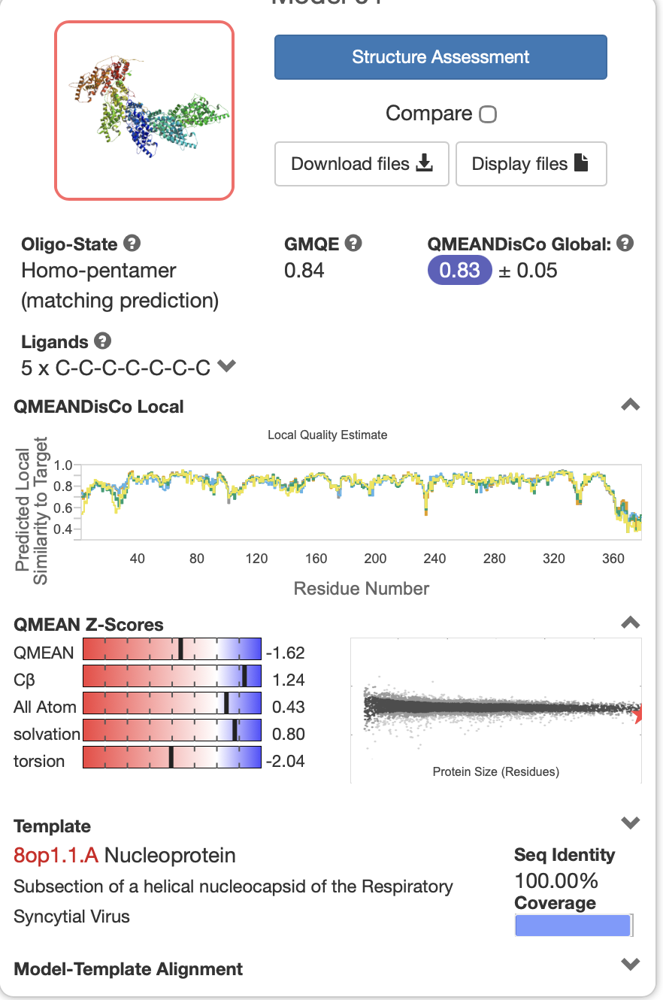
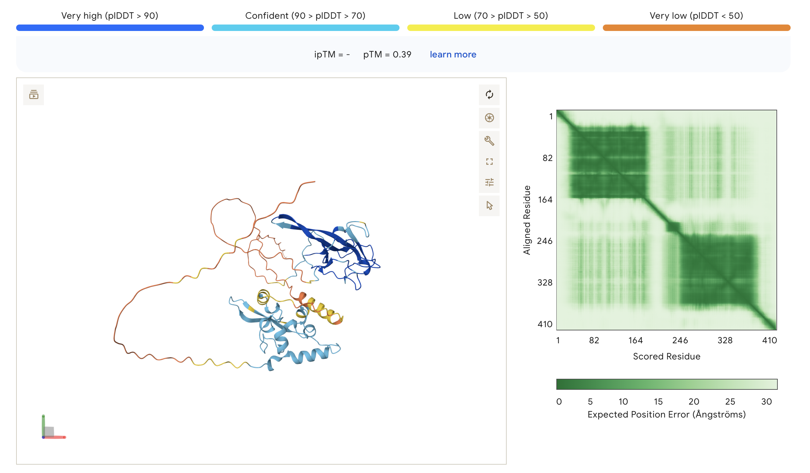
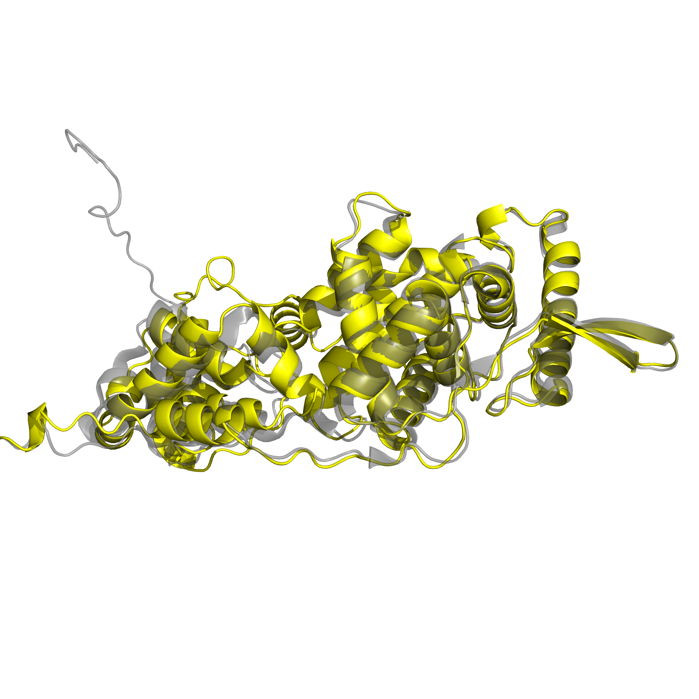
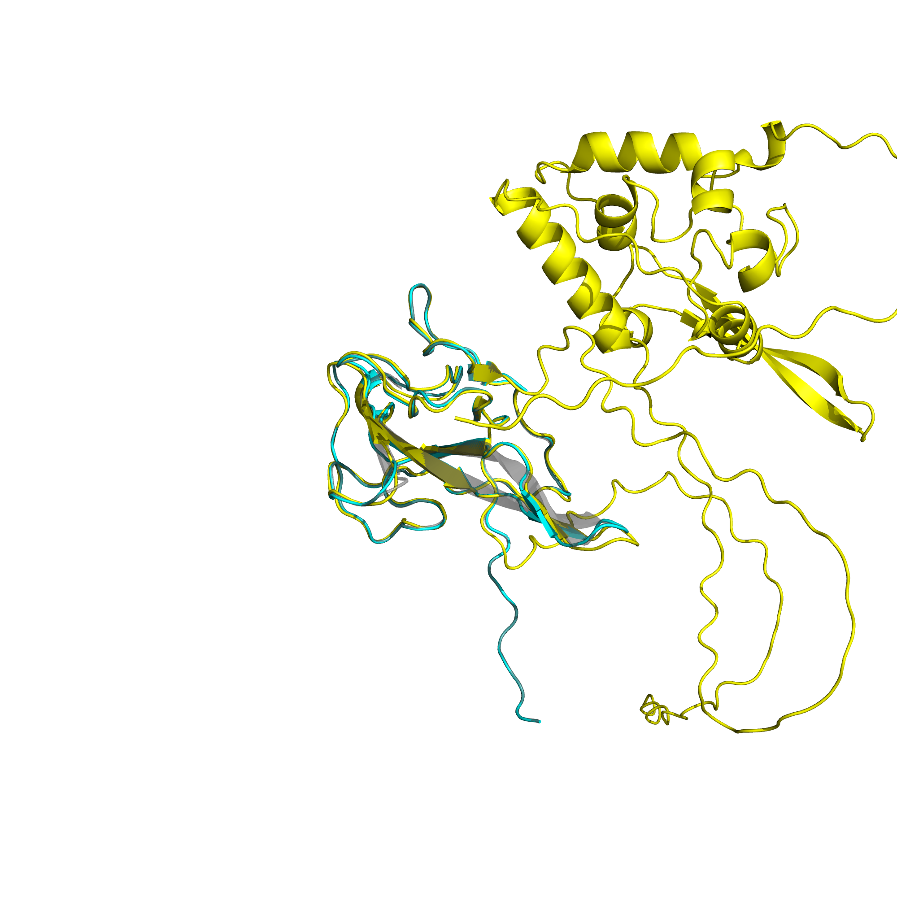
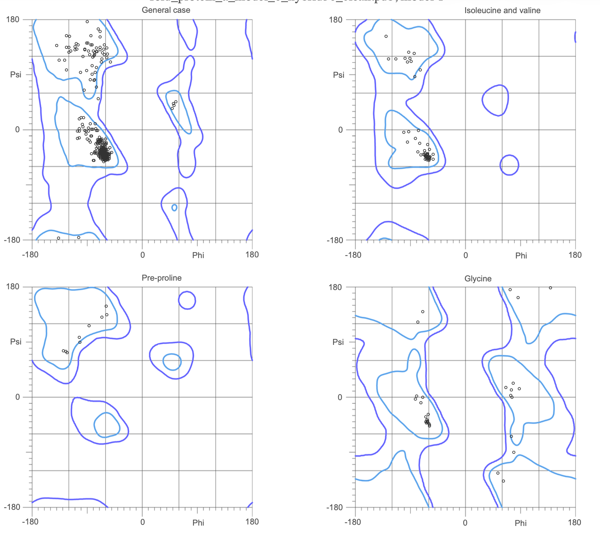

# Protein Structure Prediction and Structural Bioinformatics Analysis

This repository contains my course project for **Macromolecular Structure Prediction** at **Amirkabir University of Technology (Tehran Polytechnic)**. I analyzed two viral proteins using sequence-based annotation, homology modeling, AlphaFold2, experimental PDB structures, structural alignment, and geometry validation.

The goal was not to develop a new prediction method, but to compare complementary structural-bioinformatics tools and interpret where each method is reliable.

## What I analyzed

The two proteins had noticeably different structural behavior:

- **Protein A** was more compact and predominantly alpha-helical, with strong template support for homology modeling.
- **Protein B** had distinct N-terminal and C-terminal domains together with flexible/disordered regions, making full-length template-based modeling more difficult.

I used this difference to compare how sequence analysis, homology modeling, AlphaFold2, and experimental structures complement each other.

## Workflow

### Sequence and functional annotation

I first characterized both sequences using:

- **ExPASy ProtParam / ProtScale** for physicochemical properties and hydropathy
- **DeepTMHMM** for transmembrane-topology prediction
- **ScanProsite** for motif analysis
- **InterProScan / InterPro** for family and domain annotation
- **CATH / SCOP** and disorder annotations for additional structural context

For Protein B, the analysis identified the characteristic coronavirus nucleocapsid **NTD** and **CTD**, together with intrinsically disordered regions.

### Homology modeling

I generated homology models with **SWISS-MODEL** and evaluated template quality using sequence identity, coverage, GMQE, QMEANDisCo, and local quality estimates.

Protein A had high template coverage and was well suited to homology modeling. For Protein B, reliable template coverage was mainly available for the structured N-terminal domain rather than the full sequence.

  

### AlphaFold2 prediction

I evaluated AlphaFold2 models using **pLDDT**, **pTM**, and **PAE**.

Protein A showed high confidence across most of the structure. Protein B showed a different pattern: the structured domains were predicted more confidently, while the connecting and terminal regions had lower confidence and greater apparent flexibility.

  

### Comparison with experimental structures

I selected relevant structures from the **Protein Data Bank (PDB)** and compared them with both the homology and AlphaFold2 models.

Structural superpositions were performed in **PyMOL**, with RMSD used as one measure of agreement. Protein A showed close agreement between the predicted and experimental structures. For Protein B, the structured N-terminal domain aligned well, while the full-length AlphaFold2 model also represented regions not covered by the homology template.

  

  

### Structure validation

I used **MolProbity** and Ramachandran analysis to evaluate local geometry, including favored/allowed regions, outliers, clashscore, rotamers, and bond/angle quality.

This was especially useful for separating well-structured cores from flexible or low-confidence regions that should be interpreted more cautiously.

  

## Main observations

- **Protein A:** both homology modeling and AlphaFold2 produced structures that agreed closely with the experimental reference. Most differences were concentrated in terminal or flexible loop regions.
- **Protein B:** the NTD and CTD were structurally more defined than the intervening flexible regions. Homology modeling was useful where a strong template existed, while AlphaFold2 provided a more complete full-length view.
- The positively charged surface of Protein B's N-terminal domain was consistent with its RNA-binding role.
- Across both proteins, combining sequence annotation, confidence scores, experimental references, and geometric validation was more informative than relying on any single prediction output.

## Tools and resources

**AlphaFold2 · SWISS-MODEL · PyMOL · MolProbity · InterProScan · DeepTMHMM · ScanProsite · ExPASy · PDB · CATH · SCOP**

## Full report

The original course report is written in Persian and contains the complete analysis, figures, intermediate results, and detailed interpretation:

[**Full project report (PDF)**](report/Macro.pdf)

## Academic context

- **Course:** Macromolecular Structure Prediction
- **Institution:** Amirkabir University of Technology
- **Term:** Fall 2025
- **Author:** Maryam Jabbari
- **Instructors:** Dr. F. Zare and Dr. Z. Ghorbanali

> This repository presents a course-based structural bioinformatics analysis. The reported predictions and annotations are tool-dependent and are interpreted as computational evidence rather than experimental validation.
